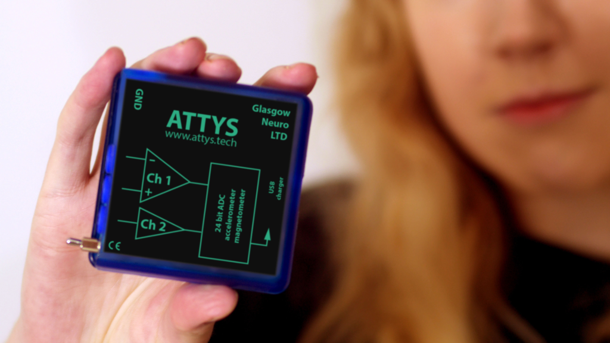

# AttysCOMM

The C++ and JAVA API for the Attys: http://www.attys.tech



The C++ class (with a Python wrapper) is in the "cpp" directory and
the JAVA class in the usual Android subdirectories.

## C++

### Installation/compilation is with cmake under Linux

```
cmake .
make
sudo make install
```

This will generate: a dynamic library libattyscomm.so, a static
one called libattyscomm_static.a and a python module called
pyattyscomm which contains exactly the class members of AttysComm
and AttysScan.

### C++ Ubuntu packages for xenial and bionic

Run from the command line:

```
sudo add-apt-repository ppa:berndporr/attys
sudo add-apt-repository ppa:berndporr/usbdux
sudo apt-get update
sudo apt-get install attyscomm attyscomm-dev
```

The example programs are under `/usr/share/doc/attyscomm-dev/`.


### Installation under Windows:
Under windows only the static library is generated which
should be used for your code development.
```
cmake -G "Visual Studio 15 2017 Win64" .
```
and then start Visual C++ and compile it.

### Usage

A small demo program is in the `demo` directory which scans
for an Attys and then prints the incoming data to stdout.
Type `cmake .`, `make` and then `./attysdemo` to run it.

Here is a step by guide how to code it:

1. scan for Attys
```
int ret = attysScan.scan();
```

2. Check the number of Attys detected
```
attysScan.nAttysDevices
```

3. If devices have been detected they show up as an array.
`attysScan.attysComm[0,1,2,etc]` points to the AttysComm instances.

4. Set the parameters, for example:
```
attysScan.attysComm[0]->setAdc_samplingrate_index(AttysComm::ADC_RATE_250HZ);
```

5. Register a callback (optional)
```
attysCallback = new AttysCallback(this);
attysScan.attysComm[0]->registerCallback(attysCallback);
```
You need to overload the virtual function of the callback in your program.

6. Start data acquisition
```
attysScan.attysComm[0]->start();
```

7. Check if ringbuffer contains data and wait till true
```
attysScan.attysComm[n]->hasSampleAvilabale();
```

8. Get samples from buffer
```
float* values = attysScan.attysComm[n]->getSampleFromBuffer();
```

9. go back to 7)

10. Ending the program:
```
attysScan.attysComm[n]->quit();
```


## JAVA

In general the java class AttysComm is well documented.
Check out the class itself.
You find all the constants and function calls there.


### Usage


1. Create AttysComm:
```
BluetoothDevice bd = AttysComm.findAttysBtDevice();
attysComm = new AttysComm(bd);
```


2. Set options

In general there are constants defined for the differnet options,
for example: AttysComm.ADC_RATE_250HZ for the sampling rate:
```
attysComm.setAdc_samplingrate_index(AttysComm.ADC_RATE_250HZ);
```

3. (Optional) Register a message listener for error messages:
```
attysComm.registerMessageListener(messageListener);
```


4. Start the data acquisition
```
attysComm.start();
```

5. Read the data from the ringbuffer in a TimerTask:
```
    class UpdatePlotTask extends TimerTask {

        public synchronized void run() {

            if (attysComm != null) {

  	        n = attysComm.getNumSamplesAvilable();
		for(int i = 0;i<n;i++) {
                    sample = attysComm.getSampleFromBuffer();
		    PROCESS / PLOT / ETC SAMPLE
		}
	    }
        }
    }
```

6. (Optional) there is also an event listener whenever a sample has arrived:
```
    public interface DataListener {
        void gotData(long samplenumber, float[] data);
    }
```
7. to stop AttysComm just call `stop()`.
It's blocking and will only return after the Thread talking to the Attys has been terminated.


## Python wrapper (SWIG)

If SWIG is installed then binary files for the python module `pyattyscomm`
are generated which have the same classes as the C++ implementation.

This libary is very fast, multi threaded and has a ring buffer. See
the features of the C++ library which are the same.

### Linux

#### From source

```./setup.py install```

and then you can load the module `pyattyscomm` system-wide!

#### Python package (pip):

Make sure you have the attyscomm libraries:
```
sudo add-apt-repository ppa:berndporr/attys
sudo add-apt-repository ppa:berndporr/usbdux
sudo apt-get update
sudo apt-get install attyscomm attyscomm-dev
```
and then install with:

```
pip3 install pyattyscomm
```

### Windows
- `Release\_pyattyscomm.exp`
- `Release\_pyattyscomm.pyd`
- `pyattyscomm.py`
Make sure to select "Release" in Visual Studio as python
is usually not installed with its debug libraries.

Copy these files into your project directory or the python site directories
for system-wide use.

## Demo programs

There are demo programs which show you how to read/plot data with pyattyscomm:

```
readdata_demo.py
realtime_plot_demo.py
```


Enjoy!

http://www.attys.tech
